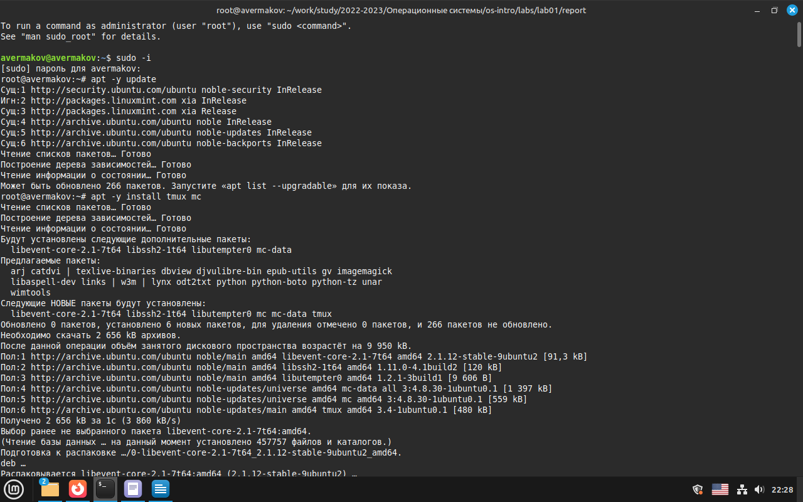
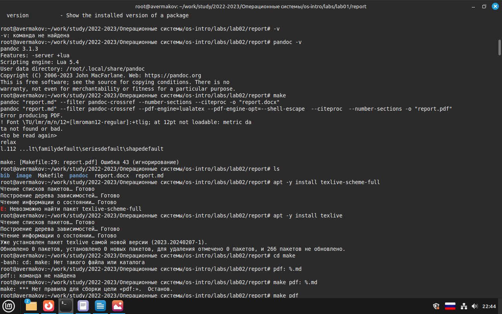
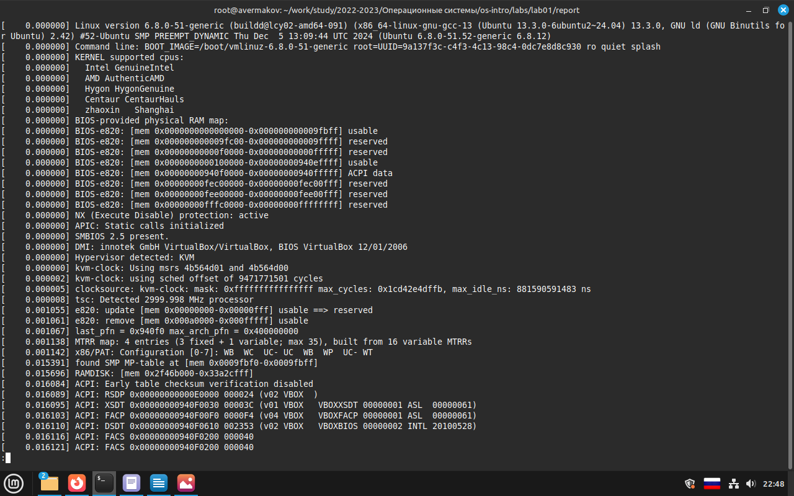
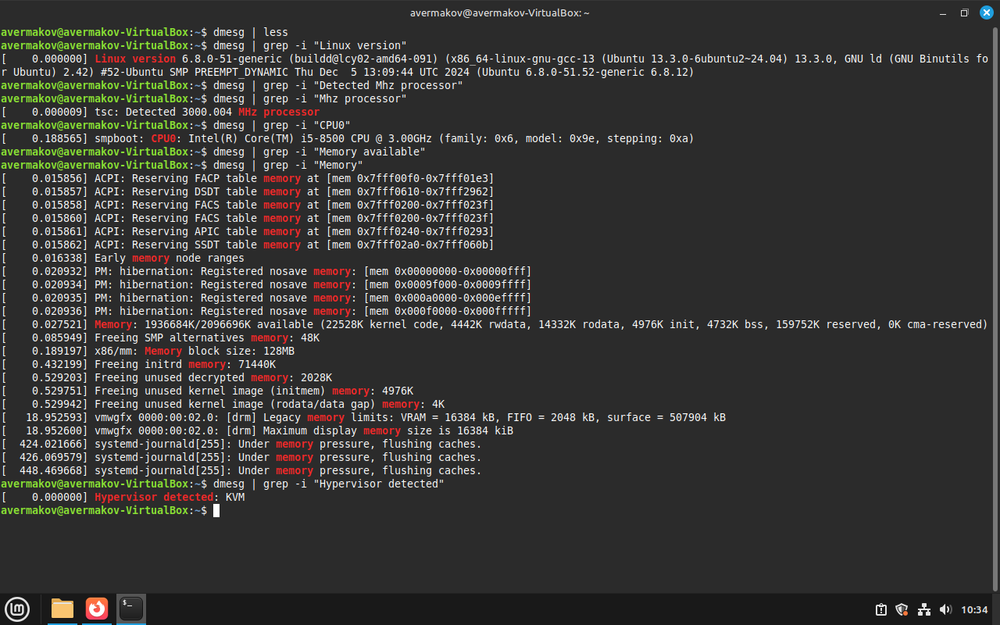

---
## Front matter
title: "Отчёт по лабораторной работе №1"
subtitle: "Установка ОС Linux"
author: "Ермаков Алексей"

## Generic otions
lang: ru-RU
toc-title: "Содержание"

## Bibliography
bibliography: bib/cite.bib
csl: pandoc/csl/gost-r-7-0-5-2008-numeric.csl

## Pdf output format
toc: true # Table of contents
toc-depth: 2
lof: true # List of figures
lot: true # List of tables
fontsize: 12pt
linestretch: 1.5
papersize: a4
documentclass: scrreprt
## I18n polyglossia
polyglossia-lang:
  name: russian
  options:
	- spelling=modern
	- babelshorthands=true
polyglossia-otherlangs:
  name: english
## I18n babel
babel-lang: russian
babel-otherlangs: english
## Fonts
mainfont: IBM Plex Serif
romanfont: IBM Plex Serif
sansfont: IBM Plex Sans
monofont: IBM Plex Mono
mathfont: STIX Two Math
mainfontoptions: Ligatures=Common,Ligatures=TeX,Scale=0.94
romanfontoptions: Ligatures=Common,Ligatures=TeX,Scale=0.94
sansfontoptions: Ligatures=Common,Ligatures=TeX,Scale=MatchLowercase,Scale=0.94
monofontoptions: Scale=MatchLowercase,Scale=0.94,FakeStretch=0.9
mathfontoptions:
## Biblatex
biblatex: true
biblio-style: "gost-numeric"
biblatexoptions:
  - parentracker=true
  - backend=biber
  - hyperref=auto
  - language=auto
  - autolang=other*
  - citestyle=gost-numeric
## Pandoc-crossref LaTeX customization
figureTitle: "Рис."
tableTitle: "Таблица"
listingTitle: "Листинг"
lofTitle: "Список иллюстраций"
lotTitle: "Список таблиц"
lolTitle: "Листинги"
## Misc options
indent: true
header-includes:
  - \usepackage{indentfirst}
  - \usepackage{float} # keep figures where there are in the text
  - \floatplacement{figure}{H} # keep figures where there are in the text
---

# Цель работы

Целью данной работы является приобретение практических навыков установки операционной системы на виртуальную машину, настройки минимально необходимых для дальнейшей работы сервисов.

# Задание

    Дождитесь загрузки графического окружения и откройте терминал. В окне терминала проанализируйте последовательность загрузки системы, выполнив команду dmesg. Можно просто просмотреть вывод этой команды:

    dmesg | less

    Можно использовать поиск с помощью grep:

    dmesg | grep -i "то, что ищем"

    Получите следующую информацию.

        Версия ядра Linux (Linux version).

        Частота процессора (Detected Mhz processor).

        Модель процессора (CPU0).

        Объём доступной оперативной памяти (Memory available).

        Тип обнаруженного гипервизора (Hypervisor detected).

        Тип файловой системы корневого раздела.

        Последовательность монтирования файловых систем.

# Теоретическое введение

    При выполнении работ следует придерживаться следующих правил именования:
        Пользователь внутри виртуальной машины должен иметь имя, совпадающее с учётной записью студента, выполняющего лабораторную работу.
        Имя хоста вашей виртуальной машины должно совпадать с учётной записью студента, выполняющего лабораторную работу.
        Имя виртуальной машины должно совпадать с учётной записью студента, выполняющего лабораторную работу.

        В дисплейных классах вы можете посмотреть имя вашей учётной записи, набрав в терминале команду:

        id -un

    

# Выполнение лабораторной работы

После установки. Вошли в ОС под заданной вами при установке учётной записью.Нажали комбинацию Win+Enter для запуска терминала. Переключились на роль супер-пользователя: sudo -i. Обновили все пакеты
 -y update. установили программы для удобства работы в консоли: -y install tmux mc

 (рис. [-@fig:001]).

{#fig:001 width=70%}

Установии дистрибутивы pandoc для работы с языком разметки Markdown и TeXlive (рис. [-@fig:002]).

{#fig:002 width=70%}

В окне терминала проанализировали последовательность загрузки системы, выполнив команду dmesg. использовали поиск с помощью grep (рис. [-@fig:003]) (рис. [-@fig:004])

    
Получили следующую информацию.

        Версия ядра Linux (Linux version).

        Частота процессора (Detected Mhz processor).

        Модель процессора (CPU0).

        Объём доступной оперативной памяти (Memory available).

        Тип обнаруженного гипервизора (Hypervisor detected).

        Тип файловой системы корневого раздела.

        Последовательность монтирования файловых систем. .

{#fig:004 width=70%}

{#fig:003 width=70%}

# Контрольные вопросы

    Какую информацию содержит учётная запись пользователя? Учетная запись пользователя содержит информацию по авторизации - учётные данные. Это индетификатор для подключения к системе. То есть, это:
        Системное имя - должно быть уникальным, содержит только латинские знаки.
        Уникальных идентификатор пользователя в системе, содержит число.
        Полное имя - ФИО пользователя.

    Укажите команды терминала и приведите примеры:
        для получения справки по команде = --help;
        для перемещения по файловой системе = cd;
        для просмотра содержимого каталога = ls;
        для определения объёма каталога = du + имя каталога;
        для создания / удаления каталогов = mkdir/rmdir;
        для создания / удаления файлов = touch/rm;
        для задания определённых прав на файл / каталог = chmod;
        для просмотра истории команд = history;

    Что такое файловая система? Приведите примеры с краткой характеристикой. Это способ хранения, организации и именования данных на различных носителях. Примеры:
        FAT32 - файловая система, в которой пространство разделено на три части: область служебных структур, указатели в виде таблиц и область хранения файлов;
        ext4 - система, которая используется в основном в ОС на Linux. Журналируемая файловая система, в послдней версии максимальный размер файла - 16Гб.

    Как посмотреть, какие файловые системы подмонтированы в ОС? Для этого нужно ввести в терминал команду df - это покажет список всех файловых систем по номерам устройств, размеры и данные о памяти. Но при этом можно посмотреть в свойствах папок все эти данные вручную.

    Как удалить зависший процесс?
        killall - остановит все процессы, которые есть в данный момент.
        kill + id-процесса. Это поможет удалить один конкретный процесс. (Чтобы узнать id нужно написать в терминале команду ps).

# Выводы

В ходе данной работы приобрел практические навыки установки операционной системы на виртуальную машину, настройки минимально необходимых для дальнейшей работы сервисов.

# Список литературы{.unnumbered}

::: {#refs}
:::
