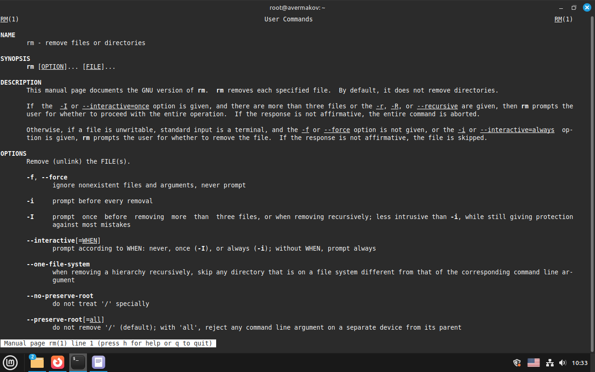

---
## Front matter
title: "Лабораторная работа № 4"
subtitle: "Основы интерфейса взаимодействия
пользователя с системой Unix на уровне командной строки"
author: "Ермаков Алексей"

## Generic otions
lang: ru-RU
toc-title: "Содержание"

## Bibliography
bibliography: bib/cite.bib
csl: pandoc/csl/gost-r-7-0-5-2008-numeric.csl

## Pdf output format
toc: true # Table of contents
toc-depth: 2
lof: true # List of figures
lot: true # List of tables
fontsize: 12pt
linestretch: 1.5
papersize: a4
documentclass: scrreprt
## I18n polyglossia
polyglossia-lang:
  name: russian
  options:
	- spelling=modern
	- babelshorthands=true
polyglossia-otherlangs:
  name: english
## I18n babel
babel-lang: russian
babel-otherlangs: english
## Fonts
mainfont: IBM Plex Serif
romanfont: IBM Plex Serif
sansfont: IBM Plex Sans
monofont: IBM Plex Mono
mathfont: STIX Two Math
mainfontoptions: Ligatures=Common,Ligatures=TeX,Scale=0.94
romanfontoptions: Ligatures=Common,Ligatures=TeX,Scale=0.94
sansfontoptions: Ligatures=Common,Ligatures=TeX,Scale=MatchLowercase,Scale=0.94
monofontoptions: Scale=MatchLowercase,Scale=0.94,FakeStretch=0.9
mathfontoptions:
## Biblatex
biblatex: true
biblio-style: "gost-numeric"
biblatexoptions:
  - parentracker=true
  - backend=biber
  - hyperref=auto
  - language=auto
  - autolang=other*
  - citestyle=gost-numeric
## Pandoc-crossref LaTeX customization
figureTitle: "Рис."
tableTitle: "Таблица"
listingTitle: "Листинг"
lofTitle: "Список иллюстраций"
lotTitle: "Список таблиц"
lolTitle: "Листинги"
## Misc options
indent: true
header-includes:
  - \usepackage{indentfirst}
  - \usepackage{float} # keep figures where there are in the text
  - \floatplacement{figure}{H} # keep figures where there are in the text
---

# Цель работы

Приобретение практических навыков взаимодействия пользователя с системой посредством командной строки.

# Задание

1. Определите полное имя вашего домашнего каталога. Далее относительно этого каталога будут выполняться последующие упражнения.
2. Выполните следующие действия:

2.1. Перейдите в каталог /tmp.

2.2. Выведите на экран содержимое каталога /tmp. Для этого используйте команду ls

с различными опциями. Поясните разницу в выводимой на экран информации.

2.3. Определите, есть ли в каталоге /var/spool подкаталог с именем cron?

2.4. Перейдите в Ваш домашний каталог и выведите на экран его содержимое. Определите, кто является владельцем файлов и подкаталогов?
3. Выполните следующие действия:

3.1. В домашнем каталоге создайте новый каталог с именем newdir.
3.2. В каталоге ~/newdir создайте новый каталог с именем morefun.

3.3. В домашнем каталоге создайте одной командой три новых каталога с именами letters, memos, misk. Затем удалите эти каталоги одной командой.

3.4. Попробуйте удалить ранее созданный каталог ~/newdir командой rm. Проверьте,был ли каталог удалён.

3.5. Удалите каталог ~/newdir/morefun из домашнего каталога. Проверьте, был ли каталог удалён.

4. С помощью команды man определите, какую опцию команды ls нужно использовать для просмотра содержимое не только указанного каталога, но и подкаталогов,
входящих в него.
5. С помощью команды man определите набор опций команды ls, позволяющий отсортировать по времени последнего изменения выводимый список содержимого каталога
с развёрнутым описанием файлов.
6. Используйте команду man для просмотра описания следующих команд: cd, pwd, mkdir,rmdir, rm. Поясните основные опции этих команд.
7. Используя информацию, полученную при помощи команды history, выполните модификацию и исполнение нескольких команд из буфера команд
# Теоретическое введение

В операционной системе типа Linux взаимодействие пользователя с системой обычно
осуществляется с помощью командной строки посредством построчного ввода команд. При этом обычно используется командные интерпретаторы языка shell: /bin/sh; /bin/csh; /bin/ksh.
Формат команды. Командой в операционной системе называется записанный по специальным правилам текст (возможно с аргументами), представляющий собой ука-
зание на выполнение какой-либо функций (или действий) в операционной системе.
Обычно первым словом идёт имя команды, остальной текст — аргументы или опции, конкретизирующие действие.
Общий формат команд можно представить следующим образом:
<имя_команды><разделитель><аргументы>
Команда man. Команда man используется для просмотра (оперативная помощь) в диалоговом режиме руководства (manual) по основным командам операционной системы
типа Linux.
Формат команды:
man <команда>

# Выполнение лабораторной работы

Перешли в каталог /tmp.Вывели на экран содержимое каталога /tmp. Определили наличие в каталоге /var/spool подкаталог с именем cron. (рис. [-@fig:001]).

{#fig:001 width=70%}

Перешли в  домашний каталог и вывели на экран его содержимое. Определили кто является владельцем файлов и подкаталогов.
В домашнем каталоге создали новый каталог с именем newdir.В каталоге ~/newdir создали новый каталог с именем morefun.В домашнем каталоге создали одной командой три новых каталога с именами letters, memos, misk. Затем удалили эти каталоги одной командой. Удалили ранее созданный каталог ~/newdir командой rm. Проверили что,был ли каталог удалён.Удалили каталог ~/newdir/morefun из домашнего каталога. Проверили что, был ли каталог удалён. (рис. [-@fig:002]).

{#fig:002 width=70%}

С помощью команды man определили, какую опцию команды ls нужно использовать для просмотра содержимое не только указанного каталога, но и подкаталогов,
входящих в него и набор опций команды ls, позволяющий отсортировать по времени последнего изменения выводимый список содержимого каталога
с развёрнутым описанием файлов.(рис. [-@fig:003]).

{#fig:003 width=70%}

Использовали команду man для просмотра описания опций команды pwd (рис. [-@fig:004]).

{#fig:004 width=70%}

Использовали команду man для просмотра описания опций команды mkdir  (рис. [-@fig:005]).

{#fig:005 width=70%}

Использовали команду man для просмотра описания опций команды rmdir (рис. [-@fig:006]).

{#fig:006 width=70%}

Использовали команду man для просмотра описания опций команды rm (рис. [-@fig:007]).

{#fig:007 width=70%}

# Контрольные вопросы

    Что такое командная строка?

Командная строка - это текстовый интерфейс взаимодействия человека и компьютера, в котором компьютеру даются некоторые инструкции, путём их ввода с клавиатуры. Интерфейс командной строки противопоставляется управлению командами на основе меню и при помощи графического интерфейса.

    При помощи какой команды можно определить абсолютный путь текущего каталога? Приведите пример.

Абсолютный путь текущего каталога можно определить при помощи команды pwd. Например, Чтобы определить абсолютный путь каталога в котором мы находимся нужно написать в командной строке:

-> pwd

    При помощи какой команды и каких опций можно определить только тип файлов и их имена в текущем каталоге? Приведите примеры.

При помощи команды ls -F.

-> ls -F

    Каким образом отобразить информацию о скрытых файлах? Приведите примеры.

При помощи команды ls -a.

    При помощи каких команд можно удалить файл и каталог? Можно ли это сделать одной и той же командой? Приведите примеры.

Удалить файл или каталог можно при помощи команды rm, rmdir - только пустой каталог, rm -r - любой файл или непустой каталог.

Удаление и создание

    Каким образом можно вывести информацию о последних выполненных пользователем командах? работы?

При помощи команды history.

    Как воспользоваться историей команд для их модифицированного выполнения? Приведите примеры.

Нужно написать следующую конструкцию:

!<Номер команды>:s/<ЧТО меняем>/<НА что меняем>

    Приведите примеры запуска нескольких команд в одной строке.

Когда требуется выполнить несколько команд в одной строке, пишем символ ; (точка с запятой)

cd work; ls

    Дайте определение и приведите примера символов экранирования.

Если в заданном контексте встречаются символы (".", "/", "*" и т.д.), то перед ними нудно поставить кавычки как символ экранирования. Также они ставятся, когда текст - просто текст, а не команда.

    Охарактеризуйте вывод информации на экран после выполнения команды ls с опцией l.

Чтобы вывести на экран подробную информацию о файлах и каталогах, нужно использовать команду ls с опцией l. При этом о каждом файле и каталоге будет выведена следующая информация: тип файла, право доступа, число ссылок, владелец, размер, дата последней ревизии, имя файла или каталога.

    Что такое относительный путь к файлу? Приведите примеры использования относительного и абсолютного пути при выполнении какой-либо команды.

Относительный путь - это ссылка, указывающая, на другие каталоги, относительно каталога, в котором мы находимся. Допустим, я сейчас нахожусь в каталоге report, который содержит каталог images. Тогда, чтобы перейти в каталог images мне достаточно написать команду cd images. 

    Как получить информацию об интересующей вас команде?

Чтобы получить информацию об интересующей меня команде есть два пути: команда help или команда man.

    Какая клавиша или комбинация клавиш служит для автоматического дополнения вводимых команд?

Клавиша Tab.

# Выводы

Были получены практические навыки взаимодействия  с системой посредством командной строки и изучены команды ls, cd, pwd, mkdir,
rmdir, rm.

# Список литературы{.unnumbered}

1. GNU Bash Manual [Электронный ресурс]. Free Software Foundation, 2016. URL:
https://www.gnu.org/software/bash/manual/.
2. Newham C. Learning the bash Shell: Unix Shell Programming. O’Reilly Media, 2005. 354
с.
3. Zarrelli G. Mastering Bash. Packt Publishing, 2017. 502 с.
4. Robbins A. Bash Pocket Reference. O’Reilly Media, 2016. 156 с.
5. Таненбаум Э. Архитектура компьютера. 6-е изд. СПб.: Питер, 2013. 874 с.
6. Таненбаум Э., Бос Х. Современные операционные системы. 4-е изд. СПб.: Питер, 2015. 1120 с. 
