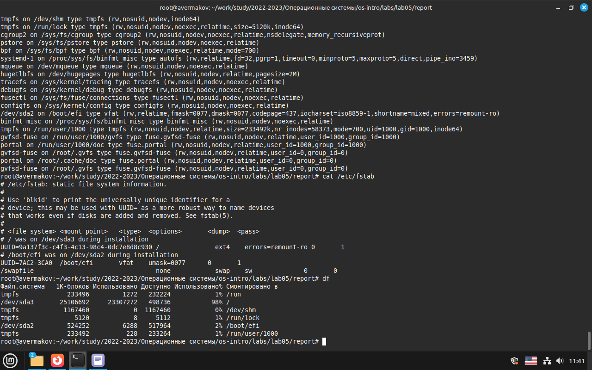

---
## Front matter
title: "Лабораторная работа № 5"
subtitle: "Анализ файловой системы Linux.
Команды для работы с файлами и каталогами"
author: "Ермаков Алексей"

## Generic otions
lang: ru-RU
toc-title: "Содержание"

## Bibliography
bibliography: bib/cite.bib
csl: pandoc/csl/gost-r-7-0-5-2008-numeric.csl

## Pdf output format
toc: true # Table of contents
toc-depth: 2
lof: true # List of figures
lot: true # List of tables
fontsize: 12pt
linestretch: 1.5
papersize: a4
documentclass: scrreprt
## I18n polyglossia
polyglossia-lang:
  name: russian
  options:
	- spelling=modern
	- babelshorthands=true
polyglossia-otherlangs:
  name: english
## I18n babel
babel-lang: russian
babel-otherlangs: english
## Fonts
mainfont: IBM Plex Serif
romanfont: IBM Plex Serif
sansfont: IBM Plex Sans
monofont: IBM Plex Mono
mathfont: STIX Two Math
mainfontoptions: Ligatures=Common,Ligatures=TeX,Scale=0.94
romanfontoptions: Ligatures=Common,Ligatures=TeX,Scale=0.94
sansfontoptions: Ligatures=Common,Ligatures=TeX,Scale=MatchLowercase,Scale=0.94
monofontoptions: Scale=MatchLowercase,Scale=0.94,FakeStretch=0.9
mathfontoptions:
## Biblatex
biblatex: true
biblio-style: "gost-numeric"
biblatexoptions:
  - parentracker=true
  - backend=biber
  - hyperref=auto
  - language=auto
  - autolang=other*
  - citestyle=gost-numeric
## Pandoc-crossref LaTeX customization
figureTitle: "Рис."
tableTitle: "Таблица"
listingTitle: "Листинг"
lofTitle: "Список иллюстраций"
lotTitle: "Список таблиц"
lolTitle: "Листинги"
## Misc options
indent: true
header-includes:
  - \usepackage{indentfirst}
  - \usepackage{float} # keep figures where there are in the text
  - \floatplacement{figure}{H} # keep figures where there are in the text
---

# Цель работы

Ознакомление с файловой системой Linux, её структурой, именами и содержанием
каталогов. Приобретение практических навыков по применению команд для работы
с файлами и каталогами, по управлению процессами (и работами), по проверке исполь-
зования диска и обслуживанию файловой системы

# Задание

1. Выполните все примеры, приведённые в первой части описания лабораторной работы.

2. Выполните следующие действия, зафиксировав в отчёте по лабораторной работе
используемые при этом команды и результаты их выполнения:

2.1. Скопируйте файл /usr/include/sys/io.h в домашний каталог и назовите его
equipment. Если файла io.h нет, то используйте любой другой файл в каталоге
/usr/include/sys/ вместо него.

2.2. В домашнем каталоге создайте директорию ~/ski.plases.

2.3. Переместите файл equipment в каталог ~/ski.plases.

2.4. Переименуйте файл ~/ski.plases/equipment в ~/ski.plases/equiplist.

2.5. Создайте в домашнем каталоге файл abc1 и скопируйте его в каталог
~/ski.plases, назовите его equiplist2.

2.6. Создайте каталог с именем equipment в каталоге ~/ski.plases.

2.7. Переместите файлы ~/ski.plases/equiplist и equiplist2 в каталог
~/ski.plases/equipment.

2.8. Создайте и переместите каталог ~/newdir в каталог ~/ski.plases и назовите
его plans.

3. Определите опции команды chmod, необходимые для того, чтобы присвоить перечис-
ленным ниже файлам выделенные права доступа, считая, что в начале таких прав
нет:

3.1. drwxr--r-- ... australia

3.2. drwx--x--x ... play

3.3. -r-xr--r-- ... my_os

3.4. -rw-rw-r-- ... feathers

При необходимости создайте нужные файлы

# Теоретическое введение

Для создания текстового файла можно использовать команду touch.

Формат команды:

touch имя-файла

Для просмотра файлов небольшого размера можно использовать команду cat.

Формат команды:

cat имя-файла

Для просмотра файлов постранично удобнее использовать команду less.

Формат команды:

less имя-файла

# Выполнение лабораторной работы

Выполните все примеры, приведённые в первой части описания лабораторной работы. Создали текстовые файлы, прочитали их целиком и постранично, переместили и переименовали их, настроили права доступа(рис. [-@fig:001]).

{#fig:001 width=70%}

Провели анализ файловой системы командой mount. (рис. [-@fig:002]).

{#fig:002 width=70%}

Определили объём свободного пространства на файловой системе  командой df, которая выведет на экран список всех файловых систем в соответствии с именами устройств, с указанием размера и точки монтирования. (рис. [-@fig:003]).

{#fig:003 width=70%}

Нашли и скопировали файл /usr/include/sys/аio.h в домашний каталог и назвали его equipment.. (рис. [-@fig:004]).

{#fig:004 width=70%}

В домашнем каталоге создали директорию ~/ski.plases. Переместили файл equipment в каталог ~/ski.plases. Переименовали файл ~/ski.plases/equipment в ~/ski.plases/equiplist. Создали в домашнем каталоге файл abc1 и скопируйте его в каталог
~/ski.plases, назовите его equiplist2. Создали каталог с именем equipment в каталоге ~/ski.plases. Переместите файлы ~/ski.plases/equiplist и equiplist2 в каталог ~/ski.plases/equipment.. (рис. [-@fig:005]).

{#fig:005 width=70%}

Создали требуемые файлы. Определили опции команды chmod, необходимые для того, чтобы присвоить перечис-
ленным ниже файлам выделенные права доступа, считая, что в начале таких прав
нет (рис. [-@fig:006]):

3.1. drwxr--r-- ... australia

3.2. drwx--x--x ... play

3.3. -r-xr--r-- ... my_os

3.4. -rw-rw-r-- ... feathers. 

{#fig:006 width=70%}

# Выводы

Ознакомились с файловой системой Linux, её структурой, именами и содержанием
каталогов. Приобрели практических навыков по применению команд для работы
с файлами и каталогами, по управлению процессами (и работами), по проверке исполь-
зования диска и обслуживанию файловой системы

# Список литературы{.unnumbered}

1. GNU Bash Manual [Электронный ресурс]. Free Software Foundation, 2016. URL:
https://www.gnu.org/software/bash/manual/.
2. Newham C. Learning the bash Shell: Unix Shell Programming. O’Reilly Media, 2005. 354
с.
3. Zarrelli G. Mastering Bash. Packt Publishing, 2017. 502 с.
4. Robbins A. Bash Pocket Reference. O’Reilly Media, 2016. 156 с.
5. Таненбаум Э. Архитектура компьютера. 6-е изд. СПб.: Питер, 2013. 874 с.
6. Таненбаум Э., Бос Х. Современные операционные системы. 4-е изд. СПб.: Питер, 2015. 1120 с. 
