---
## Front matter
title: "Лабораторная работа № 6"
subtitle: "Поиск файлов. Перенаправление ввода-вывода. Просмотр запущенных процессов"
author: "Ермаков Алексей"

## Generic otions
lang: ru-RU
toc-title: "Содержание"

## Bibliography
bibliography: bib/cite.bib
csl: pandoc/csl/gost-r-7-0-5-2008-numeric.csl

## Pdf output format
toc: true # Table of contents
toc-depth: 2
lof: true # List of figures
lot: true # List of tables
fontsize: 12pt
linestretch: 1.5
papersize: a4
documentclass: scrreprt
## I18n polyglossia
polyglossia-lang:
  name: russian
  options:
	- spelling=modern
	- babelshorthands=true
polyglossia-otherlangs:
  name: english
## I18n babel
babel-lang: russian
babel-otherlangs: english
## Fonts
mainfont: IBM Plex Serif
romanfont: IBM Plex Serif
sansfont: IBM Plex Sans
monofont: IBM Plex Mono
mathfont: STIX Two Math
mainfontoptions: Ligatures=Common,Ligatures=TeX,Scale=0.94
romanfontoptions: Ligatures=Common,Ligatures=TeX,Scale=0.94
sansfontoptions: Ligatures=Common,Ligatures=TeX,Scale=MatchLowercase,Scale=0.94
monofontoptions: Scale=MatchLowercase,Scale=0.94,FakeStretch=0.9
mathfontoptions:
## Biblatex
biblatex: true
biblio-style: "gost-numeric"
biblatexoptions:
  - parentracker=true
  - backend=biber
  - hyperref=auto
  - language=auto
  - autolang=other*
  - citestyle=gost-numeric
## Pandoc-crossref LaTeX customization
figureTitle: "Рис."
tableTitle: "Таблица"
listingTitle: "Листинг"
lofTitle: "Список иллюстраций"
lotTitle: "Список таблиц"
lolTitle: "Листинги"
## Misc options
indent: true
header-includes:
  - \usepackage{indentfirst}
  - \usepackage{float} # keep figures where there are in the text
  - \floatplacement{figure}{H} # keep figures where there are in the text
---

# Цель работы

Ознакомление с инструментами поиска файлов и фильтрации текстовых данных.
Приобретение практических навыков: по управлению процессами (и заданиями), по проверке использования диска и обслуживанию файловых систем.

# Задание

1. Осуществите вход в систему, используя соответствующее имя пользователя.

2. Запишите в файл file.txt названия файлов, содержащихся в каталоге /etc. Допишите в этот же файл названия файлов, содержащихся в вашем домашнем каталоге.

3. Выведите имена всех файлов из file.txt, имеющих расширение .conf, после чего запишите их в новый текстовой файл conf.txt.

4. Определите, какие файлы в вашем домашнем каталоге имеют имена, начинавшиеся с символа c? Предложите несколько вариантов, как это сделать.

5. Выведите на экран (по странично) имена файлов из каталога /etc, начинающиеся с символа h.

6. Запустите в фоновом режиме процесс, который будет записывать в файл ~/logfile файлы, имена которых начинаются с log.

7. Удалите файл ~/logfile.

8. Запустите из консоли в фоновом режиме редактор gedit.

9. Определите идентификатор процесса gedit, используя команду ps, конвейер и фильтр grep. Как ещё можно определить идентификатор процесса?

10. Прочтите справку (man) команды kill, после чего используйте её для завершения процесса gedit.

11. Выполните команды df и du, предварительно получив более подробную информацию об этих командах, с помощью команды man.

12. Воспользовавшись справкой команды find, выведите имена всех директорий, имеющихся в вашем домашнем каталоге.

# Теоретическое введение

В системе по умолчанию открыто три специальных потока:

– stdin — стандартный поток ввода (по умолчанию: клавиатура), файловый дескриптор0;

– stdout — стандартный поток вывода (по умолчанию: консоль), файловый дескриптор 1;

– stderr — стандартный поток вывод сообщений об ошибках (по умолчанию: консоль), файловый дескриптор 2.

Большинство используемых в консоли команд и программ записывают результаты своей работы в стандартный поток вывода stdout. Например, команда ls выводит в стандартный поток вывода (консоль) список файлов в текущей директории. Потоки вывода и ввода можно перенаправлять на другие файлы или устройства. Проще всего это делается с помощью символов >, >>, <, <<.

# Выполнение лабораторной работы

Осуществили вход в систему, используя соответствующее имя пользователя.Запиcали в файл file.txt названия файлов, содержащихся в каталоге /etc.(рис. [-@fig:001]).

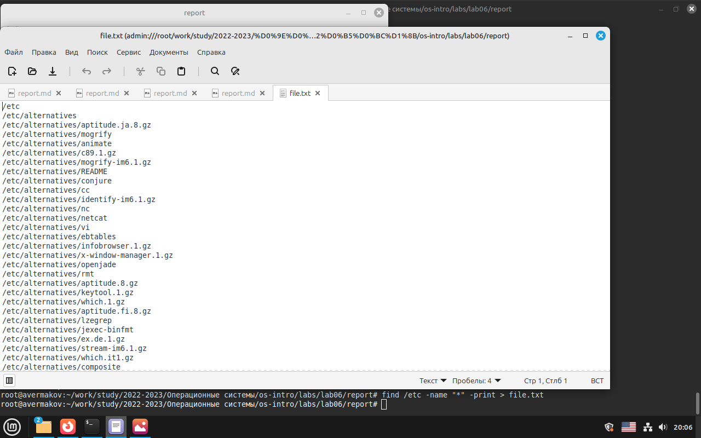{#fig:001 width=70%}

Вывели имена всех файлов из file.txt, имеющих расширение .conf, после чего записали их в новый текстовой файл conf.txt. Определили, какие файлы в домашнем каталоге имеют имена, начинавшиеся с символа h.(рис. [-@fig:002]).

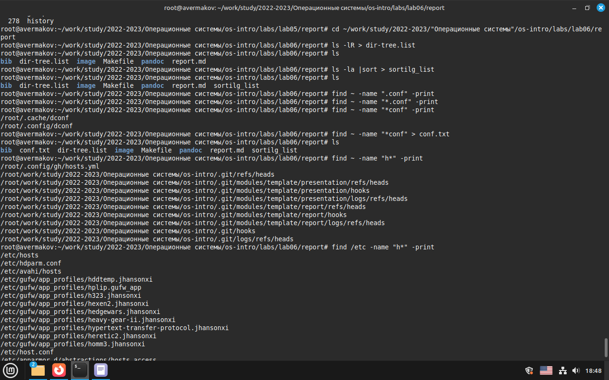{#fig:002 width=70%}

Вывеили на экран (по странично) имена файлов из каталога /etc, начинающиеся с символа h.(рис. [-@fig:003]) (рис. [-@fig:004]).

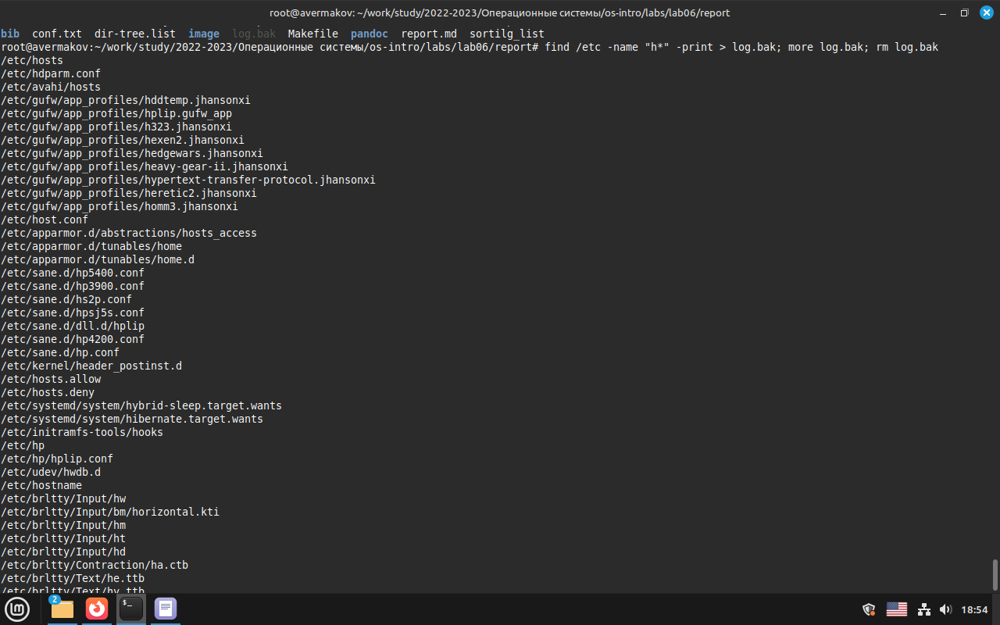{#fig:003 width=70%}

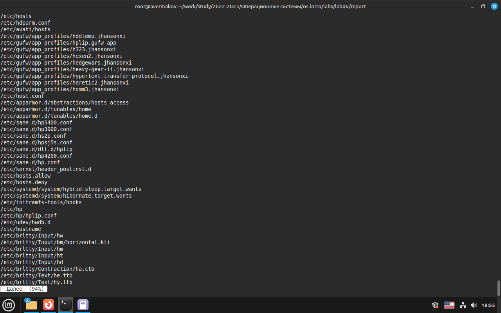{#fig:004 width=70%}

Запустили в фоновом режиме процесс, который будет записывать в файл ~/logfile файлы, имена которых начинаются с log.(рис. [-@fig:005])(рис. [-@fig:006])

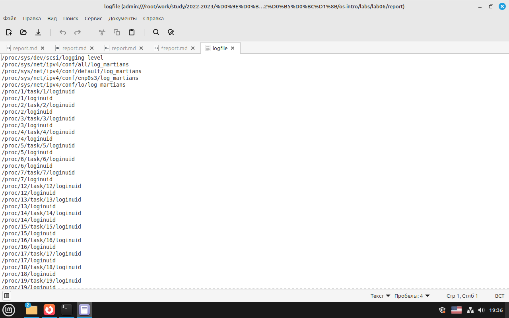{#fig:005 width=70%}

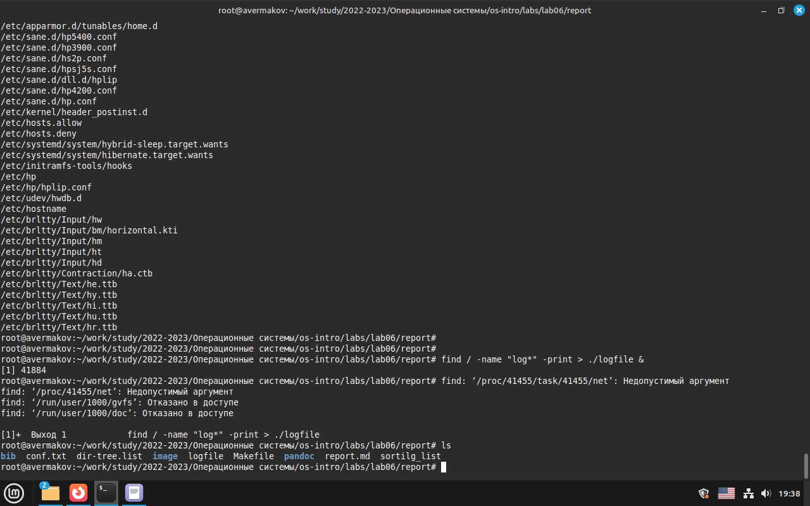{#fig:006 width=70%}

Запустили из консоли в фоновом режиме редактор gedit.(рис. [-@fig:007]).

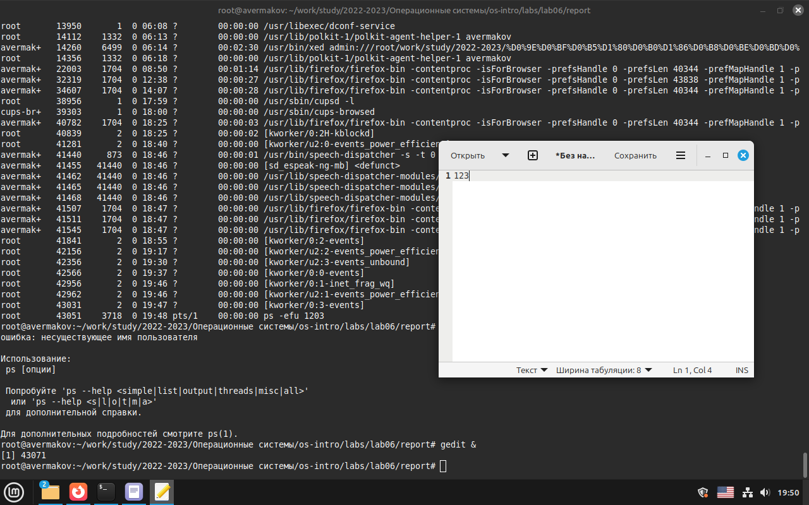{#fig:007 width=70%}

Определили идентификатор процесса gedit -43071, используя команду ps. Прочли справку (man) команды kill, после чего использовали её для завершения процесса gedit.(рис. [-@fig:008]) (рис. [-@fig:009])

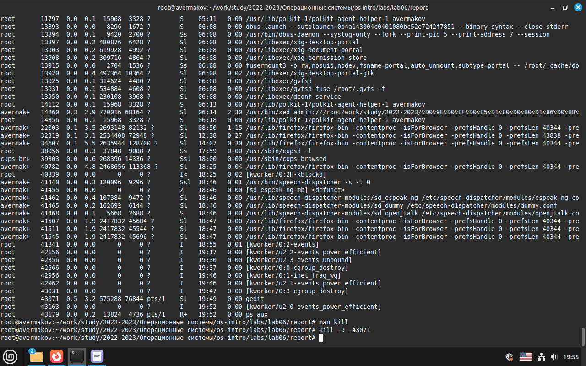{#fig:008 width=70%}

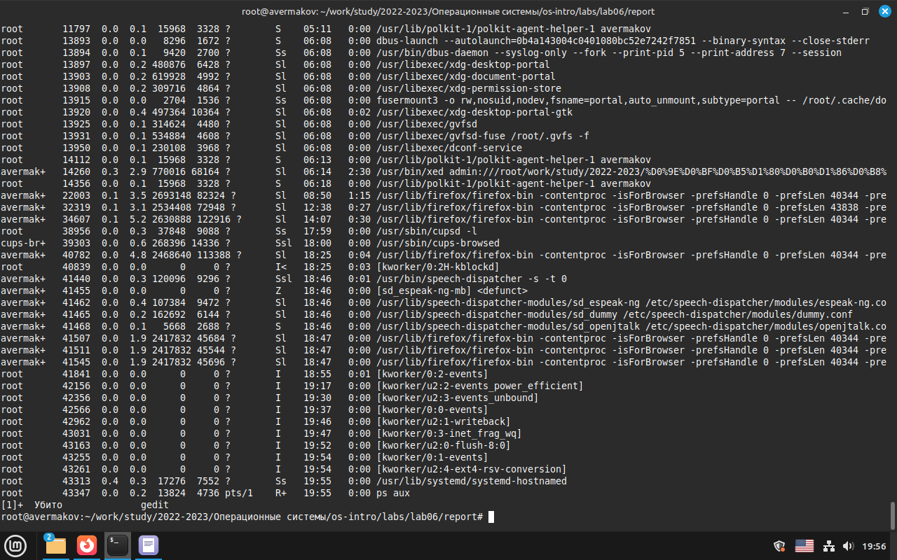{#fig:009 width=70%}

Выполнили команду df, предварительно получив более подробную информацию с помощью команды man. (рис. [-@fig:0010]).

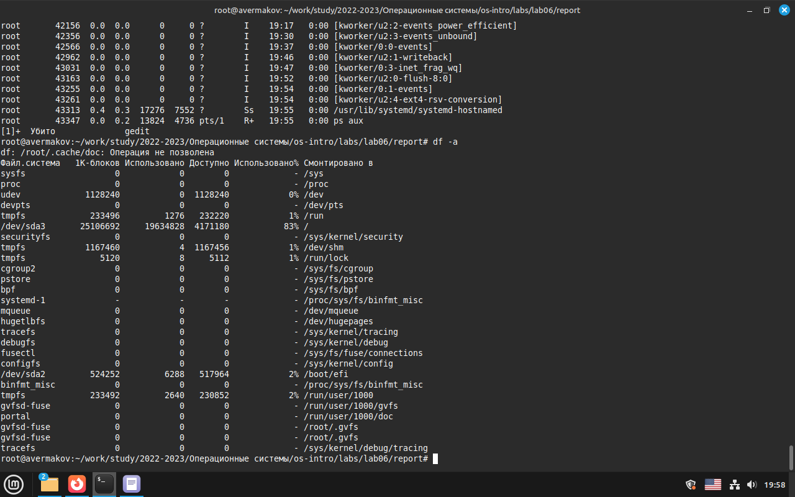{#fig:0010 width=70%}

Выполнили команду du, предварительно получив более подробную информацию с помощью команды man. (рис. [-@fig:0011]).

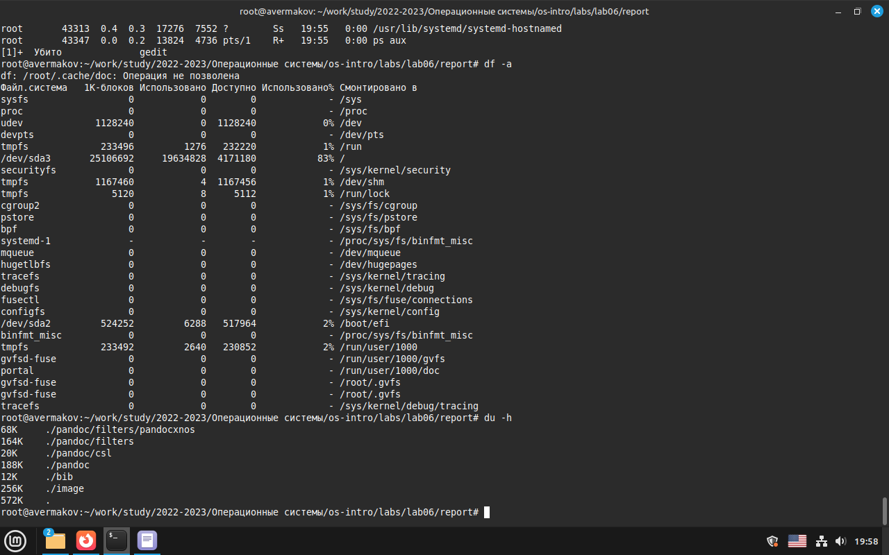{#fig:0011 width=70%}

# Контрольные вопросы

    Какие потоки ввода вывода вы знаете?

– stdin — стандартный поток ввода (по умолчанию: клавиатура), файловый дескриптор 0; – stdout — стандартный поток вывода (по умолчанию: консоль), файловый дескриптор 1; – stderr — стандартный поток вывод сообщений об ошибках (по умолчанию: консоль), файловый дескриптор 2.

    Объясните разницу между операцией > и >>.

>filename - Перенаправление вывода (stdout) в файл "filename".

>>filename - Перенаправление вывода (stdout) в файл "filename", файл открывается в режиме добавления.

    Что такое конвейер?

Конвейер (pipe) служит для объединения простых команд или утилит в цепочки, в которых результат работы предыдущей команды передаётся последующей. Синтаксис следующий:

команда 1 | команда 2

    Что такое процесс? Чем это понятие отличается от программы?

Компьютерная программа сама по себе — лишь пассивная последовательность инструкций. В то время как процесс — непосредственное выполнение этих инструкций.

    Что такое PID и GID?

Идентификатор процесса (PID). Каждому новому процессу ядро присваивает уникальный идентификационный номер. В любой момент времени идентификатор процесса является уникальным, хотя после завершения процесса он может использоваться снова для другого процесса. Некоторые идентификаторы зарезервированы системой для особых процессов. Так, процесс с идентификатором 1 - это процесс инициализации init, являющийся предком всех других процессов в системе.

Идентификатор группы GID и эффективный идентификатор группы (EGID) GID - это идентификационный номер группы данного процесса. EGID связан с GID также, как EUID с UID.

    Что такое задачи и какая команда позволяет ими управлять?

Задачи - это то, что мы подаем на выполнение системе, какой-то процесс, который она начинает выполнять.

Команда - jobs.

    Найдите информацию об утилитах top и htop. Каковы их функции?

top (table of processes) — консольная команда, которая выводит список работающих в системе процессов и информацию о них. По умолчанию она в реальном времени сортирует их по нагрузке на процессор. Программа написана для UNIX-совместимых операционных систем и опубликована под свободной лицензией GNU FDL.

htop — продвинутый монитор процессов, написанный для Linux. Он был задуман заменить стандартную программу top. Htop показывает динамический список системных процессов, список обычно выравнивается по использованию ЦПУ. В отличие от top, htop показывает все процессы в системе. Также показывает время непрерывной работы, использование процессоров и памяти. Htop часто применяется в тех случаях, когда информации даваемой утилитой top недостаточно, например при поиске утечек памяти в процессах. Htop написан на языке Си и использует для отображения библиотеку Ncurses.

    Назовите и дайте характеристику команде поиска файлов. Приведите примеры ис- пользования этой команды.

Команда find используется для поиска и отображения на экран имён файлов, соответ- ствующих заданной строке символов. Формат команды:

find <путь> <-опции>

find /etc -name "p*" -print

    Можно ли по контексту (содержанию) найти файл? Если да, то как?

Для поиска файла по содержимому проще всего воспользоваться командой grep (вместо find). Пример:

grep -r строка_поиска каталог

    Как определить объем свободной памяти на жёстком диске?

При помощи команды df (аббревиатура от disk free) — утилита в UNIX и UNIX-подобных системах, показывает список всех файловых систем по именам устройств, сообщает их размер, занятое и свободное пространство и точки монтирования.

    Как определить объем вашего домашнего каталога?

du -a ~

    Как удалить зависший процесс?

Для завершения процесса нужно вызвать утилиту kill с параметром "-9".

# Выводы

Ознакомились с инструментами поиска файлов и фильтрации текстовых данных.
Приобрели практические навыки по управлению процессами (и заданиями), по проверке использования диска и обслуживанию файловых систем.

# Список литературы{.unnumbered}

1. GNU Bash Manual [Электронный ресурс]. Free Software Foundation, 2016. URL:
https://www.gnu.org/software/bash/manual/.
2. Newham C. Learning the bash Shell: Unix Shell Programming. O’Reilly Media, 2005. 354
с.
3. Zarrelli G. Mastering Bash. Packt Publishing, 2017. 502 с.
4. Robbins A. Bash Pocket Reference. O’Reilly Media, 2016. 156 с.
5. Таненбаум Э. Архитектура компьютера. 6-е изд. СПб.: Питер, 2013. 874 с.
6. Таненбаум Э., Бос Х. Современные операционные системы. 4-е изд. СПб.: Питер, 2015. 1120 с. 
