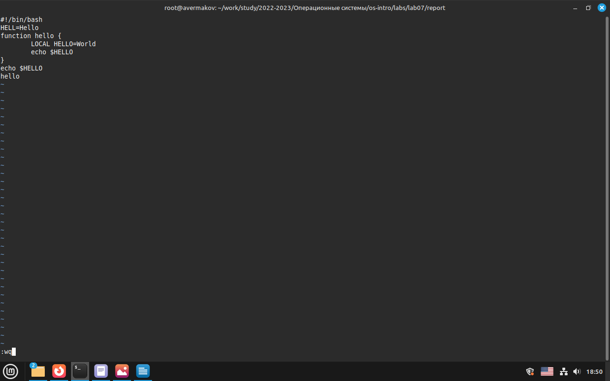
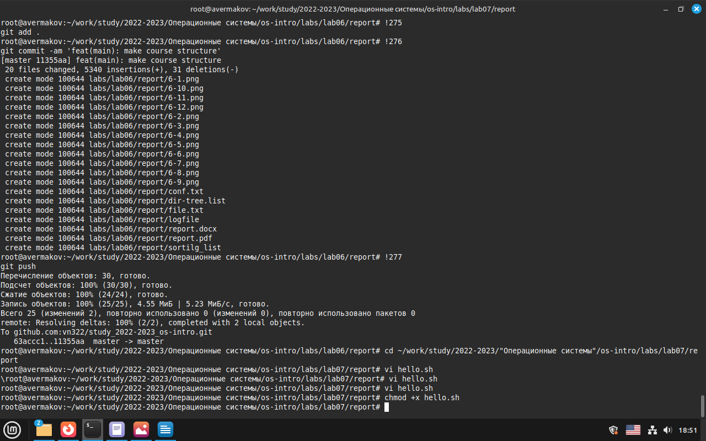
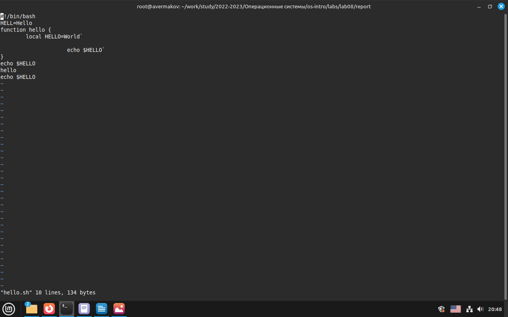
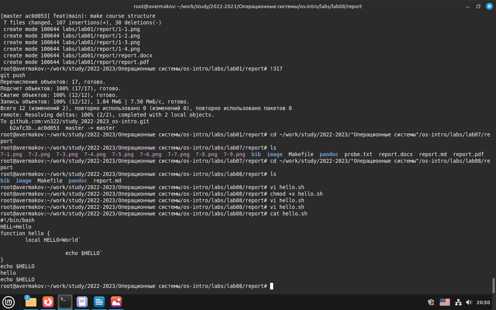

---
## Front matter
title: "Лабораторная работа №8"
subtitle: "Текстовый редактор vi"
author: "Ермаков Алексей"

## Generic otions
lang: ru-RU
toc-title: "Содержание"

## Bibliography
bibliography: bib/cite.bib
csl: pandoc/csl/gost-r-7-0-5-2008-numeric.csl

## Pdf output format
toc: true # Table of contents
toc-depth: 2
lof: true # List of figures
lot: true # List of tables
fontsize: 12pt
linestretch: 1.5
papersize: a4
documentclass: scrreprt
## I18n polyglossia
polyglossia-lang:
  name: russian
  options:
	- spelling=modern
	- babelshorthands=true
polyglossia-otherlangs:
  name: english
## I18n babel
babel-lang: russian
babel-otherlangs: english
## Fonts
mainfont: IBM Plex Serif
romanfont: IBM Plex Serif
sansfont: IBM Plex Sans
monofont: IBM Plex Mono
mathfont: STIX Two Math
mainfontoptions: Ligatures=Common,Ligatures=TeX,Scale=0.94
romanfontoptions: Ligatures=Common,Ligatures=TeX,Scale=0.94
sansfontoptions: Ligatures=Common,Ligatures=TeX,Scale=MatchLowercase,Scale=0.94
monofontoptions: Scale=MatchLowercase,Scale=0.94,FakeStretch=0.9
mathfontoptions:
## Biblatex
biblatex: true
biblio-style: "gost-numeric"
biblatexoptions:
  - parentracker=true
  - backend=biber
  - hyperref=auto
  - language=auto
  - autolang=other*
  - citestyle=gost-numeric
## Pandoc-crossref LaTeX customization
figureTitle: "Рис."
tableTitle: "Таблица"
listingTitle: "Листинг"
lofTitle: "Список иллюстраций"
lotTitle: "Список таблиц"
lolTitle: "Листинги"
## Misc options
indent: true
header-includes:
  - \usepackage{indentfirst}
  - \usepackage{float} # keep figures where there are in the text
  - \floatplacement{figure}{H} # keep figures where there are in the text
---

# Цель работы

Познакомиться с операционной системой Linux. Получить практические навы- ки работы с редактором vi, установленным по умолчанию практически во всех дистрибутивах.

# Задание

    Ознакомиться с теоретическим материалом.
    Ознакомиться с редактором vi.
    Выполнить упражнения, используя команды vi.

#Задание 1. Создание нового файла с использованием vi

    Создайте каталог с именем ~/work/os/lab06.
    Перейдите во вновь созданный каталог.
    Вызовите vi и создайте файл hello.sh. Нажмите клавишу i и вводите следующий текст.

vi hello.sh

#!/bin/bash

HELL=Hello

function hello {

LOCAL HELLO=World

echo $HELLO

}

echo $HELLO

hello

    Нажмите клавишу Esc для перехода в командный режим после завершения ввода текста. Нажмите : для перехода в режим последней строки и внизу вашего экрана появится приглашение в виде двоеточия.

    Нажмите w (записать) и q (выйти), а затем нажмите клавишу Enter для сохранения вашего текста и завершения работы.

    Сделайте файл исполняемым

chmod +x hello.sh

#Задание 2. Редактирование существующего файла

    Вызовите vi на редактирование файла

      vi hello.sh

    Установите курсор в конец слова HELL второй строки.

    Перейдите в режим вставки и замените на HELLO. Нажмите Esc для возврата в командный режим.

    Установите курсор на четвертую строку и сотрите слово LOCAL.

    Перейдите в режим вставки и наберите следующий текст: local, нажмите Esc для возврата в командный режим.

    Установите курсор на последней строке файла. Вставьте после неё строку, содержащую следующий текст: echo $HELLO.

    Нажмите Esc для перехода в командный режим. Удалите последнюю строку.

    Введите команду отмены изменений u для отмены последней команды. Введите символ : для перехода в режим последней строки. Запишите произведённые изменения и выйдите из vi.

# Теоретическое введение

ЗВ большинстве дистрибутивов Linux в качестве текстового редактора по умолча- нию устанавливается интерактивный экранный редактор vi (Visual display editor).

Редактор vi имеет три режима работы: - командный режим — предназначен для ввода команд редактирования и навигации по редактируемому файлу; - режим вставки — предназначен для ввода содержания редактируемого файла; - режим последней (или командной) строки — используется для записи изменений в файл и выхода из редактора. Для вызова редактора vi необходимо указать команду vi и имя редактируемого файла: vi При этом в случае отсутствия файла с указанным именем будет создан такой файл. Переход в командный режим осуществляется нажатием клавиши Esc . Для выхода из редактора vi необходимо перейти в режим последней строки: находясь в командном режиме, нажать Shift-; (по сути символ : — двоеточие), затем: - набрать символы wq, если перед выходом из редактора требуется записать изменения в файл; - набрать символ q (или q!), если требуется выйти из редактора без сохранения.
Более подробно про Unix см. в [@tanenbaum_book_modern-os_ru; @robbins_book_bash_en; @zarrelli_book_mastering-bash_en; @newham_book_learning-bash_en].

# Выполнение лабораторной работы

    Вызвали vi и создали файл hello.sh, нажали клавишу i и ввели следующий текст (рис. [-@fig:001])

vi hello.sh

#!/bin/bash

HELL=Hello

function hello {

`LOCAL HELLO=World`

`echo $HELLO`

}

echo $HELLO

hello .

Нажали клавишу Esc для перехода в командный режим после завершения ввода текста. 
Нажали w (записать) и q (выйти), а затем нажмали клавишу Enter для сохранения  текста и завершения работы.

{#fig:001 width=70%}

 
    Сделали файл исполняемым (рис. [-@fig:002])

chmod +x hello.sh 

{#fig:002 width=70%}

 
(рис. [-@fig:003])(рис. [-@fig:004])

Редактирование существующего файла согласно инструкции
   
    Вызвали vi на редактирование файла

    vi hello.sh

    Установили курсор в конец слова HELL второй строки.

    Перешли в режим вставки и заменили на HELLO. Нажали Esc для возврата в командный режим.

    Установили курсор на четвертую строку и стёрли слово LOCAL.

    Перешли в режим вставки и набрали следующий текст: local, нажали Esc для возврата в командный режим.

    Установили курсор на последней строке файла. Вставили после неё строку, содержащую следующий текст: echo $HELLO.

    Нажали Esc для перехода в командный режим. Удалли последнюю строку.

    Ввели команду отмены изменений u для отмены последней команды. Ввели символ : для перехода в режим последней строки. Записали произведённые изменения и выйдите из vi.

{#fig:003 width=70%}

{#fig:004 width=70%}

 

# Контрольные вопросы

    Дайте краткую характеристику режимам работы редактора vi.

    командный режим — предназначен для ввода команд редактирования и навигации по редактируемому файлу;
    режим вставки — предназначен для ввода содержания редактируемого файла;
    режим последней (или командной) строки — используется для записи из- менений в файл и выхода из редактора.

    Как выйти из редактора, не сохраняя произведённые изменения?

Можно нажимать символ q (или q!), если требуется выйти из редактора без сохранения.

    Назовите и дайте краткую характеристику командам позиционирования.

    0 (ноль) — переход в начало строки;
    $ — переход в конец строки;
    G — переход в конец файла;
    n G — переход на строку с номером n.

    Что для редактора vi является словом?

Редактор vi предполагает, что слово - это строка символов, которая может включать в себя буквы, цифры и символы подчеркивания.

    Каким образом из любого места редактируемого файла перейти в начало (конец) файла?

С помощью G — переход в конец файла

    Назовите и дайте краткую характеристику основным группам команд ре- дактирования.

    Вставка текста – а — вставить текст после курсора; – А — вставить текст в конец строки; – i — вставить текст перед курсором; – n i — вставить текст n раз; – I — вставить текст в начало строки.
    Вставка строки – о — вставить строку под курсором; – О — вставить строку над курсором.
    Удаление текста – x — удалить один символ в буфер; – d w — удалить одно слово в буфер; – d $ — удалить в буфер текст от курсора до конца строки; – d 0 — удалить в буфер текст от начала строки до позиции курсора; – d d — удалить в буфер одну строку; – n d d — удалить в буфер n строк.
    Отмена и повтор произведённых изменений – u — отменить последнее изменение; – . — повторить последнее изменение.
    Копирование текста в буфер – Y — скопировать строку в буфер; – n Y — скопировать n строк в буфер; – y w — скопировать слово в буфер.
    Вставка текста из буфера – p — вставить текст из буфера после курсора; – P — вставить текст из буфера перед курсором.
    Замена текста – c w — заменить слово; – n c w — заменить n слов; – c $ — заменить текст от курсора до конца строки; – r — заменить слово; – R — заменить текст.
    Поиск текста – / текст — произвести поиск вперёд по тексту указанной стро- ки символов текст; – ? текст — произвести поиск назад по тексту указанной строки символов текст.

    Необходимо заполнить строку символами $. Каковы ваши действия?

Перейти в режим вставки.

    Как отменить некорректное действие, связанное с процессом редактирова- ния?

С помощью u — отменить последнее изменение

    Назовите и дайте характеристику основным группам команд режима по- следней строки.

Режим последней строки — используется для записи изменений в файл и вы- хода из редактора.

    Как определить, не перемещая курсора, позицию, в которой заканчивается строка?

$ — переход в конец строки

    Выполните анализ опций редактора vi (сколько их, как узнать их назначение и т.д.).

Опции редактора vi позволяют настроить рабочую среду. Для задания опций используется команда set (в режиме последней строки): – : set all — вывести полный список опций; – : set nu — вывести номера строк; – : set list — вывести невидимые символы; – : set ic — не учитывать при поиске, является ли символ прописным или строчным.

    Как определить режим работы редактора vi?

В редакторе vi есть два основных режима: командный режим и режим встав- ки. По умолчанию работа начинается в командном режиме. В режиме вставки клавиатура используется для набора текста. Для выхода в командный режим используется клавиша Esc или комбинация Ctrl + c.

# Выводы

В процессе выполнения лабораторной работы познакомились с операционной системой Linux. Получили практические навыки работы с редактором vi, установленным по умолчанию практически во всех дистрибутивах.

# Список литературы{.unnumbered}

1. GNU Bash Manual [Электронный ресурс]. Free Software Foundation, 2016. URL: https://www.gnu.org/software/bash/manual/.
2. Newham C. Learning the bash Shell: Unix Shell Programming. O’Reilly Media, 2005. 354 с.
3. Zarrelli G. Mastering Bash. Packt Publishing, 2017. 502 с.
4. Robbins A. Bash Pocket Reference. O’Reilly Media, 2016. 156 с.
5. Таненбаум Э. Архитектура компьютера. 6-е изд. СПб.: Питер, 2013. 874 с.
6. Таненбаум Э., Бос Х. Современные операционные системы. 4-е изд. СПб.: Питер, 2015. 1120 с. 
